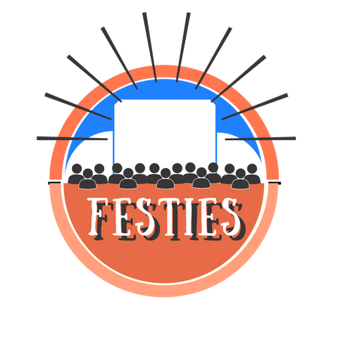

# Festies
 

## Description

Festies is a Web-Based Application that allows festival-goers to find other attendees based on artist lineup. Find friend matches and add them based on your similar music tastes.

## Technologies
- React
- Javascript
- Node.js
- Songkick API
- CSS
- MongoDB
- Passport
- BCrypt

## Getting Started

1. Visit our project at: https://gentle-gorge-71272.herokuapp.com/
2. Create an account 
3. Start searching for festivals you plan on attending.
3. Find your musical matches!

## Links

Our project can be found at:
* https://gentle-gorge-71272.herokuapp.com/

Our code can be seen at: 
* https://github.com/lauramfleig/Festies

Thanks to Songkick for letting us use their API:
* https://www.songkick.com/

## Contributors:

* Laura Fleig at https://github.com/lauramfleig
* Andre Holguin at https://github.com/sito44
* Patrick Pilatti at https://github.com/PatrickPilatti
* Jennifer Guerra at https://github.com/JennyWar
